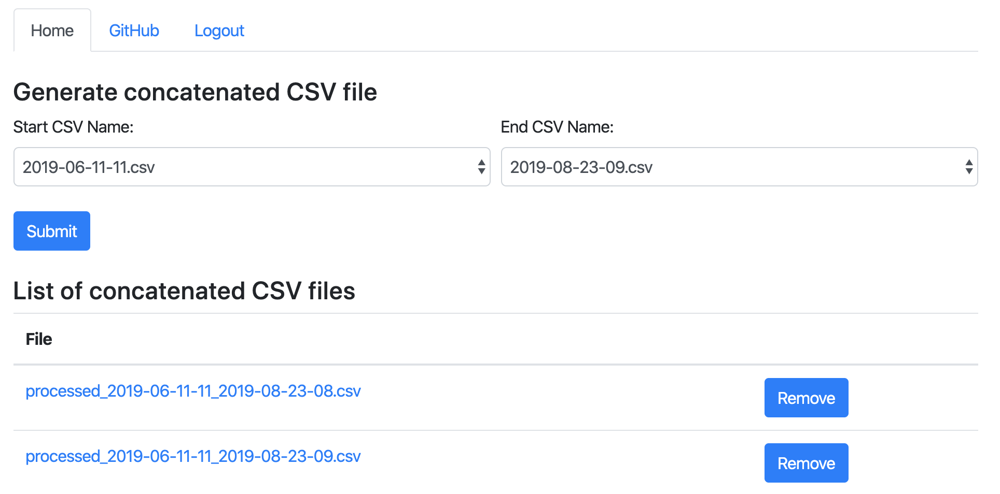

# The Future Energy Wind Turbine Data Log Analyser
An (unofficial) web application to remotely parse a directory of *.cvs files, process and concatenate the data. Can be easily expanded to sanitise cvs files from other sources.
>

## Docker Web-App
```
ADMIN_PASSWORD=< desired admin password for the web interface (default 'password') >
APP_SECRET_KEY=< a random passphrase used for cryptography (default 'DEV') >
CVS_DIR=< full path to cvs directory to process >

docker build \
  --build-arg ADMIN_PASSWORD=$ADMIN_PASSWORD \
  --build-arg APP_SECRET_KEY=$APP_SECRET_KEY \
  --tag wind_turbine_analyser .

docker run -p 8443:8443 -v $CVS_DIR:/cvs_dir wind_turbine_analyser
```
On the web browser navigate to either:
* https://localhost:8443/
* https://< ip address of server >:8443/

## Datalog Analyser plot utility
Example usage: plots values to a scatter diagram of Windspeed vs. Power.
```
> python3 plot.py -h
usage: plot.py [-h] --cvs_dir CVS_DIRECTORY

The Future Energy Wind Turbine Data Log Analyser

optional arguments:
  -h, --help            show this help message and exit
  --cvs_dir CVS_DIRECTORY
                        Directory path to CVS data log files
  --save                Output the plot to PNG
  --no-display          Do not interactively display the plot
```

## Development
### Installation
```
pip3 install -r requirements.txt
```
> (recommended) Use a virtualenv, setup for python3
https://virtualenvwrapper.readthedocs.io/en/latest/
### Tests
```
python -m unittest
flake8 datalog_analyser/datalog_analyser.py
```

### Web-App using HTTPS (recommended)
Use ```start_datalog_analyser.sh``` to run or manually:
```
gunicorn --bind=0.0.0.0:8443 --certfile=localhost.crt --keyfile=localhost.key datalog_analyser.app:APP
```
On linux one can create self-signed certificates:
```
openssl req -x509 -out localhost.crt -keyout localhost.key \
  -newkey rsa:2048 -nodes -sha256 \
  -days 825 \
  -subj '/CN=localhost' -extensions EXT -config <( \
   printf "[dn]\nCN=localhost\n[req]\ndistinguished_name = dn\n[EXT]\nsubjectAltName=DNS:localhost\nkeyUsage=digitalSignature\nextendedKeyUsage=serverAuth")
```
### Web-App using HTTP
```
gunicorn --bind=0.0.0.0:8000 datalog_analyser.app:APP
```
